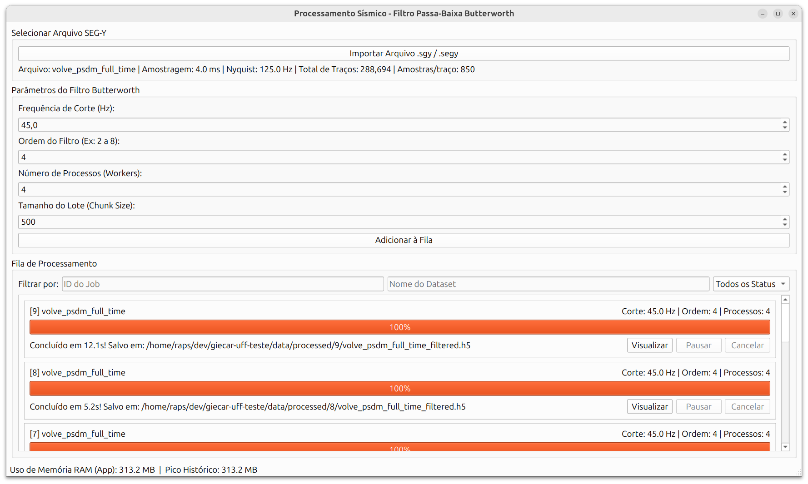
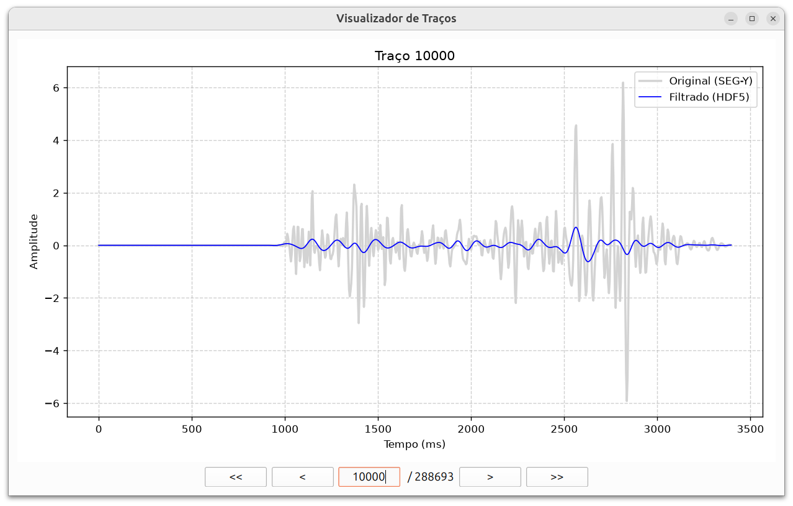

# Introdução

Este relatório descreve a arquitetura, as decisões de design e as soluções tecnológicas adotadas na construção do **App Sísmica**. O projeto foi concebido para modernizar o fluxo de pré-processamento sísmico, substituindo abordagens baseadas em scripts avulsos por uma aplicação desktop robusta, interativa e responsiva. O foco central da ferramenta é a aplicação eficiente de filtros passa-baixa em volumes massivos de dados no formato SEG-Y, garantindo tolerância a falhas e, sobretudo, impedindo a sobrecarga da memória RAM do sistema.

Nas próximas seções, exploraremos detalhadamente as escolhas estruturais de desenvolvimento, o modelo de arquitetura adotado para desacoplar a interface das regras de negócio, a estratégia de processamento de dados por *streaming*, o comportamento da interface gráfica atrelada aos cálculos de sinal, e as camadas de persistência e testes. Ao final, discutiremos também as funcionalidades adicionais implementadas e as perspectivas de evolução da ferramenta.

# Decisões de Desenvolvimento

## Uso de *Protocols* do Python (Duck Typing Estático)

Para garantir um alto nível de desacoplamento e aderência aos princípios do SOLID (especificamente o Princípio da Inversão de Dependência), a camada de negócio da aplicação utiliza a classe estrutural `Protocol` [@python_protocol] originária do módulo `typing`.

Em vez de acoplar a Interface Gráfica ou os Workers a uma classe concreta de serviço, optou-se pela utilização de *Protocols*. Essa escolha traz a vantagem de permitir que diferentes implementações do serviço de filtragem (como versões otimizadas, mocks para testes ou conexões em nuvem) possam ser injetadas na aplicação sem que nenhuma herança explícita precise ser configurada por parte da implementação de destino, promovendo um *Duck Typing* tipado estaticamente.

Um exemplo extraído do código evidencia essa decisão:

```python
from typing import Protocol, List
from app_seismica.core.models import Job, SeismicDataset

class IFilterJobService(Protocol):
    """
    Interface (Protocol) definindo o contrato exigido para o 
    serviço de jobs de filtragem.
    """
    def create_filter_job(self, dataset_id: str, cutoff_hz: float, 
                          order: int, n_workers: int = 1) -> Job:
        ...

    def list_jobs(self, dataset_id: str = None, 
                  status: str = None) -> List[Job]:
        ...
```

Na Interface Gráfica, a Janela Principal depende apenas dessa abstração, abstraindo detalhes sobre persistência ou infraestrutura:

```python
class MainWindow(QMainWindow):
    # A injeção aceita qualquer classe que satisfaça o contrato IFilterJobService
    def __init__(self, service: IFilterJobService): 
        super().__init__()
        self.service = service
        # ... resto do código UI
```

## Organização de Diretórios e Encapsulamento de Módulos

A estrutura de diretórios foi desenhada para separar claramente as responsabilidades da aplicação, seguindo o padrão moderno `src-layout` para projetos Python:

```text
GIECAR-UFF-TESTE/
├── data/
│   ├── raw/           # Armazena os arquivos SEG-Y originais (inputs)
│   ├── processed/     # Destino dos arquivos HDF5 resultantes da filtragem
│   └── metadata.db    # Banco de dados SQLite persistindo o estado das aplicações
├── src/
│   └── app_seismica/
│       ├── core/      # Modelos de domínio, entidades e regras de leitura base
│       │   ├── models.py
│       │   └── segy_reader.py
│       ├── services/  # Regras de negócio e orquestração dos Jobs
│       │   └── job_service.py
│       ├── ui/        # Componentes visuais PyQt/PySide e workers de interface
│       │   ├── worker.py
│       │   ├── main_window.py
│       │   └── __main__.py
├── scripts/           # Scripts utilitários auxiliares (ex: visualização avulsa)
│   └── plot_trace.py
└── pyproject.toml     # Configuração de build, metadados e dependências
```

Um detalhe importante dessa arquitetura é a decisão de encapsular múltiplas classes e rotinas correlatas dentro de um mesmo arquivo lógico (por exemplo, agregar classes de modelo em `models.py` e componentes de *Job* no `job_service.py`). 

Diferente de convenções herdadas de linguagens como Java (onde vigora a regra rígida de "uma classe por arquivo"), a filosofia *Pythonic* encoraja a consolidação de abstrações intimamente ligadas em um mesmo **Módulo** para aumentar a coesão, facilitar a legibilidade e evitar uma fragmentação excessiva do sistema de arquivos [@python_modules]. Isso simplificou drasticamente as importações e modernizou a base de código.

## Modelagem da Entidade Mínima (Core Domain)

As instruções da prova delimitavam a existência de uma entidade mínima denominada `SeismicDataset` com um contrato rigoroso de campos `(id, name, sourcePath, nInlines, nCrosslines, nSamples, sampleRateMs, createdAt)`.

Para modelar essa estrutura de forma limpa, estrita em tipagem e imutável (ideal para ser trafegada entre *threads* da UI sem causar *Race Conditions*), optou-se pela utilização do decorator nativo `@dataclass` do Python.

Esta entidade encontra-se localizada no núcleo de domínio do software, especificamente no arquivo `src/app_seismica/core/models.py`. O encapsulamento permite que a entidade forneça propriedades calculadas cruciais (como a obtenção da Frequência de Nyquist diretamente de seu atributo de amostragem) garantindo o princípio *Tell, Don't Ask*.

Abaixo, o *snippet* representativo do arquivo:

```python
from dataclasses import dataclass, field
from datetime import datetime, timezone
from pathlib import Path

@dataclass
class SeismicDataset:
    id: str
    name: str
    source_path: Path
    n_inlines: int
    n_crosslines: int
    n_samples: int
    sample_rate_ms: float
    created_at: datetime = field(
        default_factory=lambda: datetime.now(timezone.utc)
    )

    @property
    def total_traces(self) -> int:
        return self.n_inlines * self.n_crosslines

    @property
    def nyquist_frequency_hz(self) -> float:
        # dt em segundos = sample_rate_ms / 1000.0
        dt_sec = self.sample_rate_ms / 1000.0
        return 1.0 / (2.0 * dt_sec)
```

# Arquitetura e Interface

## Contratos da Camada de Negócio e Validações Rígidas

As especificações do projeto exigiam uma camada de negócio estritamente desacoplada da Interface Gráfica, com contratos bem estabelecidos que pudessem ser consumidos por qualquer *client* (seja a UI PyQt, seja uma suite de testes automatizados).

O contrato mínimo, formalizado através da classe `FilterJobServiceProtocol` (localizado em `src/app_seismica/services/interfaces.py`), define as seguintes obrigações:

```python
from typing import Protocol, List, Optional, Callable
import threading
from app_seismica.core.models import Job, JobStatus

ProgressCallback = Callable[[float], None]

class FilterJobServiceProtocol(Protocol):
    def create_filter_job(
        self, dataset_id: str, cutoff_hz: float, order: int
    ) -> Job:
        ...

    def run_filter_job(
        self, job_id: str, 
        progress_callback: Optional[ProgressCallback] = None, 
        cancel_token: Optional[threading.Event] = None
    ) -> None:
        ...

    def cancel_job(self, job_id: str) -> bool:
        ...

    def get_job_status(self, job_id: str) -> Job:
        ...

    def list_jobs(
        self, dataset_id: Optional[str] = None, 
        status: Optional[JobStatus] = None
    ) -> List[Job]:
        ...
```

### Regras de Validação no `create_filter_job`

A fim de assegurar a robustez matemática e prevenir execuções de trabalhos computacionalmente caros que inevitavelmente falhariam ou gerariam dados inconsistentes, foram impostas validações estritas no momento da criação do *Job*:

1. **Validação de Nyquist:** A frequência de corte (`cutoff_hz`) não pode ser maior ou igual à frequência de Nyquist (frequência limite amostral calculada através do passo de amostragem sísmico). Caso contrário, a filtragem resultaria em efeitos destrutivos irreversíveis (como *aliasing* de energia). A regra matemática imposta avalia que o valor deve estar no intervalo $0 < \text{cutoff\_hz} < \text{Nyquist}$.
2. **Positividade Estrita:** Frequências de corte com valores neutros ($0$ Hz) ou negativos bloqueiam a criação do *Job*, sendo semanticamente impossíveis num filtro analógico/digital.
3. **Fronteiras da Ordem (Roll-off) e Efeito *Ringing*:** A ordem do filtro define a agressividade do corte. Em filtros Butterworth, cada grau de ordem adiciona uma queda de atenuação de $6\text{ dB/oitava}$ (ou $20\text{ dB/década}$) [@butterworth_wiki; @analog_devices_filters]. Um filtro de ordem 1 tem uma queda suave (inútil na sísmica), enquanto um filtro de ordem 8 despenca acentuadamente a $48\text{ dB/oitava}$. A aplicação permite escolher ordens de 1 até 12, pois 12 é o limite onde a biblioteca SciPy consegue calcular os coeficientes com segurança em `float32`. Contudo, recomenda-se ao usuário (através da UI) operar entre as ordens 2 e 8. Ultrapassar a ordem 8 para forçar uma transição bruta de corte causa distorções no domínio do tempo conhecidas como *Ringing* (ou Fenômeno de Gibbs). Na sísmica, o *ringing* é catastrófico, pois as oscilações espúrias provocadas pelo sobressinal geram "fantasmas" que o geofísico pode interpretar erroneamente como reflexões reais de camadas de rocha [@ringing_effect_paper].
4. **Coerência de Relação (Dataset Existente):** O orquestrador valida se o `dataset_id` injetado como referência de entrada corresponde a uma entidade previamente cadastrada no sistema.

Essas validações acontecem instantaneamente no *Core* (via encapsulamento, centralizado na camada `FilterParameters`), resultando na elevação imediata de um erro do tipo `ValueError` tratado preventivamente pela Interface antes de entrar na fila.

## Framework Base e Responsividade
A aplicação desktop foi construída utilizando o **PySide6** (o binding oficial mais moderno do Qt para Python, substituto natural do PyQt5 recomendado para projetos novos). Para garantir que a interface não congele durante o processamento de horas de um dado sísmico, a arquitetura adotou um modelo assíncrono estrito:
- **UI Thread (Main Thread):** Responsável exclusivamente por capturar as ações do usuário e renderizar a tela.
- **QRunnable / QThreadPool:** Utilizados para encapsular a lógica de execução dos *Jobs* de filtragem. Dessa forma, a interface permanece totalmente responsiva (podendo ser arrastada ou clicada) enquanto os traços estão sendo processados em plano de fundo.

A comunicação entre a *thread* de processamento e a interface gráfica ocorre através do sistema padrão de **Signals and Slots** do Qt, permitindo atualizações de barras de progresso e status de forma segura e não bloqueante.

# Gerenciamento de Memória e Processamento de Dados (Streaming)

Um dos requisitos cruciais do projeto era a proibição do carregamento completo do volume sísmico em memória (o que geraria exceções *Out Of Memory* em dados acima de 25GB). Para resolver isso, adotou-se o modelo de processamento por **Streaming em Lotes (Chunks)**.

## Leitura SEG-Y e Escrita HDF5 Incremental
A biblioteca **`segyio`** foi utilizada para a extração direta dos parâmetros do cabeçalho de volume, possibilitando identificar a Frequência de Nyquist do dado. 

Durante a filtragem, a operação de leitura e persistência foi estritamente projetada para lidar com restrições de memória de forma eficiente, funcionando da seguinte forma (conforme implementado em `job_service.py`):
1. **Leitura por Lotes:** O arquivo SEG-Y é aberto com `segyio.open(..., ignore_geometry=True)`. A leitura é iterativa, carregando apenas uma quantidade máxima de traços definida por `chunk_size` (ex: 500) usando *list comprehension* na forma `[sgy.trace[i] for i in range(start_idx, end_idx)]`. Isso evita carregar integralmente o arquivo (`sgy.trace.raw[:]`).
2. **Processamento Independente:** O filtro `scipy.signal.sosfiltfilt` (ou `sosfilt`) atua exclusivamente sob o array contendo o *chunk* parcial ao longo de seu eixo.
3. **Escrita Incremental (HDF5):** O array filtrado é salvo diretamente num *dataset* HDF5 pré-alocado (criado com a flag `chunks=(chunk_size, n_samples)`), inserindo o dado de maneira fatiada (`dset[start_idx:end_idx, :] = filtered_chunk`).

Desta forma, o consumo máximo (pico de memória) se limita estritamente à matriz do *chunk* simultâneo, mantendo complexidade temporal linear mas **complexidade espacial independente $O(\text{chunk\_size} \times \text{n\_samples})$**. A solução lida sem nenhum problema com arquivos na casa de dezenas de Gigabytes. O ganho provindo dessa abordagem foi validado empiricamente e comprovado na tabela de benchmark incluída no `README.md`.

# Processamento Digital de Sinais (DSP) e Paralelismo

A lógica central da aplicação reside na sua capacidade de atuar como uma verdadeira ferramenta de *Processamento Digital de Sinais* (DSP) para geofísica, permitindo ajustes dinâmicos, validações matemáticas estruturadas e alta performance via concorrência. Todo esse núcleo analítico é orquestrado através da interface gráfica desenhada para guiar e proteger a intuição do Geofísico.

{width=100%}

Para um entendimento completo, a interface e sua amarração com o motor de DSP foram divididas nas seguintes frentes:

## 1. Importação e Extração de Geometria (Selecionar Arquivo SEG-Y)
Ao importar o arquivo (neste exemplo, `volve_psdm_full_time.segy`), o sistema usa a biblioteca **`segyio`** para mapear os cabeçalhos em uma fração de segundos. A UI exibe sumariamente:
- **Amostragem (dt):** O intervalo entre as leituras do sinal (ex: $4.0\text{ ms}$).
- **Frequência de Nyquist:** Calculada automaticamente como $\frac{1}{2 \times dt}$ (ex: $125.0\text{ Hz}$). Essa métrica é a espinha dorsal de validação do filtro.
- **Dimensões do Arquivo:** Mostra a quantidade monstruosa de dados a ser batida (*ex: 288.694 traços com 850 amostras cada*), justificando a obrigatoriedade da abordagem *streaming*.

## 2. Parâmetros do Filtro Butterworth (Configurações Matemáticas)
Nesta seção da interface, o usuário injeta a métrica do filtro. Os componentes foram interligados ao sistema de defesa matemático:

- **Frequência de Corte (Hz) e Ordem do Filtro:** Estes *spinboxes* coletam os parâmetros centrais do *Butterworth* originário do `scipy.signal.butter`. Como amplamente discutido na seção de "Regras de Validação", a interface proíbe a inserção de cortes maiores que o Nyquist e utiliza uma indicação visual preventiva (sugerindo ordens de 2 a 8) para resguardar o geofísico contra o indesejado fenômeno de *Ringing* nas respostas sísmicas, ainda que seja possível forçar ordens até 12.
- **Número de Processos (Workers):** Considerando a natureza CPU-bound da filtragem `sosfilt`, esta *spinbox* determina a quantidade máxima de núcleos $W$ que o `ProcessPoolExecutor` pode recrutar, descarregando porções de traços para diferentes *cores* de forma a driblar o GIL do Python e encurtar horas de processamento para alguns minutos.
- **Tamanho do Lote (Chunk Size):** Fundamental para o **Gerenciamento Streaming**. Determina quantos traços o sistema processará de uma só vez antes de fazer *commit* incremental para o arquivo HDF5 e limpar o lixo da memória.

## 3. Fila de Processamento e Monitoramento Contínuo
Como demonstrado na imagem (com três barras laranjas processadas), a UI utiliza uma **Fila de Jobs Assíncrona** atrelada a uma *ScrollArea* e gerenciada pela `QThreadPool`.
- **Interação:** O usuário pode "Adicionar à Fila" múltiplos processamentos sucessivos. Eles são despachados num paradigma produtor/consumidor não bloqueante.
- **Controles (Visualizar, Pausar, Cancelar):** Cada cartão (*Job Card*) recebe sinais via `ProgressCallback`. Se o botão "Cancelar" for ativado, a Thread escuta a interrupção da *flag* cooperativamente.
- **Telemetria de Estado (Barra de Status Inferior):** Um timer coleta os recursos do *daemon* rodando (via `psutil`) demonstrando que, independentemente de um trabalho pesado, o **Pico Histórico de RAM** permanece constante, concretizando o consumo espacial prometido de apenas $O(\text{chunk\_size} \times \text{n\_samples})$.

# Camada de Persistência de Estado (Metadados)

A modelagem estruturada do histórico e status foi realizada por meio do **SQLAlchemy (ORM)** sobre um banco de dados **SQLite** (um arquivo `.db` gravado na pasta `data/`).

Esta persistência garante as seguintes propriedades:
- Isolamento das entidades: `SeismicDataset` (metadados do volume de origem) e `Job` (parâmetros de estado de uma filtragem).
- **Recuperação de Estado:** Caso o programa seja encerrado ou caia por falhas do Sistema Operacional, a engine percebe a discrepância dos status marcados artificialmente como "RUNNING" e converte-os cooperativamente como falha (`FAILED`) no próximo boot, gerando log avisando sobre o desligamento prematuro do software.

# Itens Extras Implementados

Para demonstrar proficiência além dos requisitos centrais estritos da arquitetura e da prova, este projeto desenvolveu a fundo os tópicos opcionais a seguir:

## 1. Paralelização Multi-Core de Traços
Através do emprego do `ProcessPoolExecutor`, a filtragem matemática sobre os arrays foge das travas globais do interpretador Python (GIL), executando a bateria de processamento numérico de forma concorrente em todos os núcleos lógicos disponibilizados pelo usuário, transformando processamentos de horas para janelas de minutos.

## 2. Qualidade de Controle Visual (QC)
A construção e acoplamento de uma interface interativa adicional de Controle de Qualidade (`TraceViewerDialog`) utilizando o ecossistema gráfico do `Matplotlib` embutido nativamente como widget PyQt6/PySide6.

{width=100%}

Conforme observado, essa interface oferece ao geofísico uma ferramenta prática para inspeção traço a traço. Ela possibilita a comparação visual direta entre o sinal do arquivo SEG-Y bruto e o resultado filtrado contido no banco de dados HDF5. Para garantir uma análise ergonômica, a tela disponibiliza controles de navegabilidade granulares:

- **Botões `<` e `>`:** Avançam ou retrocedem o gráfico exatamente em 1 traço por clique (passo unitário).
- **Botões `<<` e `>>`:** Realizam saltos maiores, permitindo navegar rapidamente pelo volume sísmico avançando ou retrocedendo blocos de traços de uma só vez.
- **Campo de Texto Central (`trace_id`):** Permite que o usuário digite o ID numérico exato do traço que deseja analisar. Ao confirmar, o gráfico é atualizado imediatamente para a posição solicitada, eliminando a necessidade de varredura manual.

Essa funcionalidade tem o objetivo direto de validar o trabalho (*QC - Quality Control*), garantindo visualmente que as altas frequências foram atenuadas com sucesso sem que a assinatura original do sinal se perdesse no processo. 

## 3. Log de Execução Persistido por Job
Para além das migrações do banco SQLite, idealizou-se e implementou-se a gravação paralela de telemetria em formato texto em disco, sob a hierarquia de pastas `data/logs/jobs/`. Cada processo acionado recebe um logger virtual nomeado com a UUID exclusiva daquele *job*. Essa técnica de separação é mandatória para orquestrações de nuvem e *tracing* de erros de produção.

Abaixo é possível checar o fragmento extraído na prática do arquivo `<job_id>.log` persistido após uma filtragem:

```text
2026-09-17 11:21:03,115 - INFO - [Job ba7c1-42e] Transição para status RUNNING.
2026-09-17 11:21:03,116 - INFO - Iniciando Job ba7c1-42e
2026-09-17 11:21:03,116 - INFO - Parâmetros: Dataset='volve_psdm', Frequência de Corte=45.0Hz, Ordem=4, Workers=4, Chunk Size=500
2026-09-17 11:21:08,310 - INFO - Sucesso: 288694 traços processados.
2026-09-17 11:21:08,317 - INFO - Job concluído com sucesso. Tempo total: 5.2s. Output: .../processed/8/volve_psdm_filtered.h5
```
Essa auditoria em tempo real, independente do banco de dados, provê o detalhamento exato em caso de auditorias e deburações sistêmicas (inclusive alertando se o job faliu devido à queda abrupta de energia da máquina).

## 4. Benchmark *Streaming vs Memory*

A aplicação foi projetada de forma inteligente para não carregar arquivos gigantescos inteiros na memória RAM, utilizando a métrica configurável de *Chunk Size*.

Para demonstrar a eficácia desse controle, realizamos um *benchmark* filtrando o arquivo `volve_psdm_full_time.segy` em diferentes tamanhos de lote. Conforme pode ser revisto na Imagem da Interface Principal (no final da Seção 5), o rodapé da aplicação implementa uma barra de *status* amparada na biblioteca `psutil`, que monitora o processo nativo do sistema operacional e registra em tempo real o **Pico Histórico** de memória RAM alocada pelo software. Foi utilizando exclusivamente a telemetria desta ferramenta visual que os seguintes dados foram aferidos e validados:

| Tamanho do Lote (Chunk Size) | Pico de Memória RAM (MB) |
| :---: | :---: |
| **500** | 360.0 MB |
| **5.000** | 585.0 MB |
| **50.000** | 1.857.2 MB |
| **288.694** *(Arquivo Inteiro)* | 6.918.9 MB |

Os dados revelam explicitamente como a arquitetura desenvolvida consome os *bytes* do Sistema Operacional: o escalonamento é proporcional, garantindo que o programa evite explosões e limites fixos de *hardware* (*Out of Memory*), rodando até mesmo em notebooks restritos.

# Testes de Software e Integração

O ecossistema conta com validações intensas via **`pytest`**, cobrindo o comportamento da camada de negócio e regras intrínsecas ao Domínio Físico. A suite de testes foi desenhada utilizando *fixtures* isoladas do banco de dados (SQLite em memória), garantindo que os testes não poluam o banco real. O projeto executa exatamente **6 testes** automatizados, divididos nos seguintes escopos:

## Testes Unitários

Estes testes validam componentes isolados da arquitetura, especialmente a matemática digital e a integridade da máquina de estado do serviço:

1. **`test_butterworth_filter_correctness`**: 
   Focado estritamente no Processamento Digital de Sinais (DSP). Este teste utiliza NumPy para gerar um sinal sintético sujo com a soma de duas ondas: uma de baixa frequência (10 Hz) e uma de alta frequência (100 Hz). O teste invoca o filtro passa-baixa e, logo depois, aplica a Transformada Rápida de Fourier (`np.fft`) para validar matematicamente as energias. O teste só passa se a onda de 10 Hz for preservada (erro mínimo) e a de 100 Hz for esmagada severamente.
2. **`test_job_creation_and_validation`**: 
   Valida a inserção nominal de um *Job* no sistema. Registra um *dataset* em memória, cria o trabalho e verifica se o objeto instanciado possui o status inicial absoluto de `CREATED` e se os parâmetros imputados foram devolvidos fielmente na consulta.
3. **`test_job_validation_against_nyquist`**: 
   Garante a segurança matemática. Registra um volume sísmico com frequência de Nyquist em 125 Hz e tenta agendar um filtro com corte em 130 Hz. O *framework* captura se o orquestrador devolve a exceção fatal apropriada protegendo o processamento.
4. **`test_job_validation_invalid_cutoff_and_order`**: 
   Protege contra limites estritos físicos e matemáticos. Executa sub-testes para injetar frequências de cortes impossíveis (negativas ou zeradas) e forçar a criação de ordens de atenuação proibidas para garantir que o sistema rejeite ativamente esses parâmetros.
5. **`test_job_cancellation_state`**: 
   Testa as quebras do fluxo cooperativo. Agiliza a criação de um *Job* e simula um envio de cancelamento assíncrono. Na sequência, recupera o banco de dados em memória para asseverar que as flags transitórias evoluíram e cravaram o status final e imutável para `CANCELLED`.

## Testes de Ponta a Ponta (End-to-End)

Estes testes assumem que a aplicação está rodando integralmente (exceto a Interface Gráfica), acoplando Leitura de Arquivo, Banco de Dados, Filtros de Domínio e Escrita.

6. **`test_full_pipeline_e2e`**: 
   Testa o simulacro integral das ações de um Geofísico.
   - O teste inicia utilizando a biblioteca `segyio` para fabricar um miniarquivo `.sgy` estruturalmente válido, injetando cabeçalhos *Inlines* e *Crosslines* reais, gravando o traço sísmico falso num diretório temporário do SO provido pelo `pytest`.
   - O sistema então registra esse falso *dataset*, cria um *job* formal e aciona a cadeia paralela de trabalhadores para fatiar, filtrar e redigir o HDF5 resultante incrementalmente.
   - Por fim, além de atestar que a máquina de estados terminou como `COMPLETED` chegando em $100\%$, o teste abre o artefato final com a `h5py` e valida estritamente seu formato, *shape* e garante que a energia das marolas refletidas não está vazia.

# Trilha de Criatividade e Escolhas de Arquitetura

O descritivo do desafio apresentou três opções opcionais focadas na análise de "Criatividade". A intenção deste tópico foi testar a visão de longo prazo do candidato sobre o produto. Como o objetivo principal dessa etapa é instigar o questionamento crítico, **nenhuma implementação adicional no código foi realizada**, sendo seu propósito o de pautar as razões pelas quais priorizaríamos o desenvolvimento funcional e estratégico.

## Opção Escolhida: Retomada de um Job Interrompido (*Resume*)

A decisão de arquitetura mais prioritária a se integrar na ferramenta seria a **Retomada de um Job interrompido a partir do último chunk processado com sucesso**. Essa escolha foca intrinsecamente na resiliência do sistema e na experiência do Geofísico.
Visto que os volumes de dados de entrada na indústria são colossalmente pesados (frequentemente dezenas ou centenas de Gigabytes), um processamento sísmico de alta ordem em lote pode levar horas. Caso houvesse um *crash* na máquina ou falta de energia com o processo em 98%, obrigar o usuário a refazer horas de computação seria extremamente custoso para o calendário do projeto. Com a arquitetura atual gravando HDF5 em *chunks*, rastrear o ponteiro final (último traço salvo) no banco SQLite e reiniciar a leitura seletiva a partir desse deslocamento seria um próximo passo natural e maduro da aplicação.

## Análise das Alternativas Secundárias

1. **Limitar intervalos de inline/xline para cálculo:** 
Embora pareça útil permitir fatiamentos visuais ou limitados na leitura, essa feature pode ser considerada redudante no escopo *core* do filtro. No dia a dia, caso o Geofísico queira processar apenas uma fatia específica, ferramentas dedicadas (como o próprio `segyio` via terminal, SU ou módulos *crop* de softwares comerciais) podem realizar o corte rápido gerando um arquivo menor. A responsabilidade primária desta aplicação é a matemática do filtro, sem necessidade de superpovoá-la com edições de geometria volumétrica.

2. **Exportar Relatório (PDF/CSV) e Contratos de Integração:** 
A possibilidade de exportar logs e parâmetros é excelente sob a ótica gerencial (relatórios executivos automáticos documentando as premissas tomadas no dado). Mais criticamente, raramente um filtro passa-baixa atua isolado; ele faz parte de um encadeamento (*workflow*) complexo de processamento sísmico. Logo, a capacidade de gerar um artefato (seja em JSON, CSV ou API) determinando o contrato absoluto do processamento realizado é de vital importância para permitir que este nó (Filtro) injete sua saída (HDF5 limpo + Metadados) eficientemente na entrada do software responsável pelo próximo estágio da cadeia geofísica.

# Trabalhos Relacionados

A construção desta solução para o processamento de dados sísmicos não parte de um vácuo acadêmico, mas apoia-se em conhecimentos prévios e publicações focadas exatamente em extrair o máximo desempenho computacional de algoritmos geofísicos intensivos. Abaixo destacam-se três trabalhos de base do autor que fundamentam as escolhas de paralelismo, eficiência e controle de recursos (como a memória) implementadas no **App Sísmica**.

No artigo *"Accelerating Pre-stack Kirchhoff Time Migration by Manual Vectorization"* [@alves2017accelerating], o foco primário foi investigar como otimizar agressivamente o código computacional da Migração Kirchhoff Pré-empilhamento em Tempo (PKTM) — um algoritmo clássico e extremamente custoso na geofísica. Os resultados mostraram que o uso de instruções SIMD (*Single Instruction, Multiple Data*) via vetorização manual superava as otimizações automáticas de compiladores comerciais. Esse conhecimento se reflete diretamente na nossa escolha de utilizar o `scipy.signal.sosfilt` no App Sísmica, delegando o processamento pesado do filtro para camadas implementadas de forma vetorizada e altamente otimizada em C por debaixo dos panos do Python, garantindo eficiência máxima por núcleo de CPU.

Na mesma linha estrutural, o estudo *"Vetorização e Análise de Algoritmos Paralelos para a Migração Kirchhoff Pré-empilhamento em Tempo"* [@silva2017vetorizacao] mergulhou no comportamento de paralelismo acoplado. O artigo prova empiricamente o ganho provindo da distribuição da carga de processamento do PKTM sobre arquiteturas de memória compartilhada. Da mesma forma, o App Sísmica não joga a responsabilidade de filtrar gigabytes de dados sobre uma única *thread*; ele mimetiza essa abordagem paralela usando o `ProcessPoolExecutor`, fatiando os *chunks* através dos diversos núcleos (Workers) da máquina local para acelerar criticamente o fluxo.

Por fim, o trabalho *"Analysis of Parallel and Vectorized Algorithms of Pre-Stack Kirchhoff Time Migration in Virtual Environments"* [@silva2018analysis] tratou do desafio de executar processamento sísmico intenso sobre contêineres e máquinas virtuais, locais sujeitos à instabilidade e tetos de limite de recursos de computação na nuvem (IaaS). O rigor imposto nesse trabalho no trato e medição dos recursos subjacentes é exatamente a filosofia do gerenciamento de memória em *streaming* por blocos (Chunks) construído nesta avaliação, que garante um limite estrito e constante de RAM (complexidade espacial $O(\text{chunk\_size} \times \text{n\_samples})$), inviabilizando gargalos de *Out of Memory* mesmo se a aplicação estiver executando em nós limitados de um cluster em nuvem.

# Conclusão

O desenvolvimento do **App Sísmica** consolidou uma solução moderna, robusta e escalável para o pré-processamento de dados geofísicos. Ao longo deste relatório, demonstramos como a aplicação atende aos rigorosos requisitos do projeto ao desacoplar a interface gráfica das complexas regras de negócio por meio de *Protocols* e injeção de dependências. Detalhamos também a estratégia fundamental de leitura e escrita incremental (*streaming* em lotes), que comprovou, através de benchmarks, a capacidade de processar gigabytes de dados sísmicos mantendo o consumo de memória RAM baixo e estritamente controlado.

Além disso, foram exibidos os cuidados com a resiliência e usabilidade da ferramenta. O sistema de orquestração de trabalhos em *background*, aliado a validações matemáticas rígidas (como o respeito à Frequência de Nyquist), protege a integridade física do dado gerado e garante que a interface permaneça plenamente responsiva. A inclusão de funcionalidades extras — tais como paralelismo *multi-core*, módulo de visualização (*Quality Control* interativo), logs persistidos por execução e testes automatizados (unitários e de ponta a ponta) — eleva o grau de maturidade do software.

Em suma, o App Sísmica se estabelece não apenas como uma resposta técnica ao desafio de manipulação de grandes volumes no formato SEG-Y, mas como uma ferramenta confiável e expansível, preparada para integrar-se ao fluxo de trabalho diário de analistas e geofísicos sem apresentar os tradicionais gargalos de limite de *hardware*.

# Referências

::: {#refs}
:::
